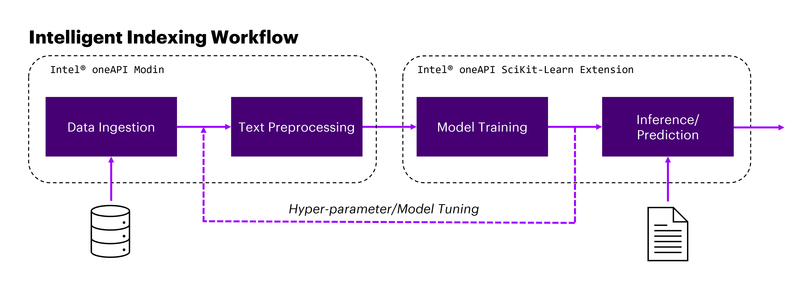

# **Scikit-Learn Intelligent Indexing for Incoming Correspondence**

## Introduction
Many industries ingest massive volumes of complex documents and must utilize manual processes to both understand the contents of and route them to the relevant parties. AI-based Natural Language Processing (NLP) solutions for classifying documents can be one solution to automate this process, saving massive amounts of workforce, time, and cost while still maintaining human-level performance.

This example demonstrates one way of building an NLP pipeline for classifying documents to their respective topics and describe how we can leverage the [Intel® oneAPI AI Analytics Toolkit](https://www.intel.com/content/www/us/en/developer/tools/oneapi/ai-analytics-toolkit.html) (oneAPI) to accelerate the pipeline.

## Solution Technical Overview
Methodology wise, the use case will train a Support Vector Classifiers (SVC) for multiclass classification which ingests a body of text and outputs the predicted topic of the document.  At deployment, natural text is first mapped into Term Frequency-Inverse Document Frequency (TFIDF) vectors, which is then fed into our trained SVC to obtain predictions about the potential topic of the original text. SVC is a commonly and historically used algorithm for building powerful NLP classifiers using Machine Learning (ML) due to its ability to tackle the highly non-linear and complex relationships often found in text documents [[1]](#joachims_1998)[[2]](#manning_2010). With recent advancements in NLP based solutions, it can be seen as a starting point before considering more advanced Deep Learning (DL) based NLP algorithms.



The savings gained from using [Intel® oneAPI Data Analytics Library](https://www.intel.com/content/www/us/en/developer/tools/oneapi/onedal.html) (oneDAL) can result in more efficient model training and inference, leading to more robust Artificial Intelligence (AI) powered systems.

oneDAL is used to achieve quick results even when the data for a model are huge. It provides the capability to reuse the code present in different languages so that the hardware utilization is optimized to provide these results.

The solution contained in this repo uses the following Intel® packages:

* ***Intel® Distribution for Python****

    The [Intel® Distribution for Python*](https://www.intel.com/content/www/us/en/developer/tools/oneapi/distribution-for-python.html#gs.52te4z) provides:

    * Scalable performance using all available CPU cores on laptops, desktops, and powerful servers
    * Support for the latest CPU instructions
    * Near-native performance through acceleration of core numerical and machine learning packages with libraries like the Intel® oneAPI Math Kernel Library (oneMKL) and Intel® oneAPI Data Analytics Library
    * Productivity tools for compiling Python code into optimized instructions
    * Essential Python bindings for easing integration of Intel® native tools with your Python* project

* ***Intel® Distribution of Modin\****

    The [Intel® Distribution of Modin*](https://www.intel.com/content/www/us/en/developer/tools/oneapi/distribution-of-modin.html) is a performant, parallel, and distributed dataframe system that is designed around enabling data scientists to be more productive with the tools that they love. This library is fully compatible with the pandas API. It is powered by OmniSci* in the back end and provides accelerated analytics on Intel® platforms.

    Top Benefits:
    1. Drop-in acceleration to your existing pandas workflows.
    2. No upfront cost to learning a new API.
    3. Integrates with the Python* ecosystem.
    4. Seamlessly scales across multicores with Ray* and Dask* clusters (run on and with what you have).

* ***Intel® Extension for Scikit-learn\****

    Designed for data scientists, [Intel® Extension for Scikit-Learn*](https://www.intel.com/content/www/us/en/developer/tools/oneapi/scikit-learn.html) is a seamless way to speed up your Scikit-learn applications for machine learning to solve real-world problems. This extension package dynamically patches scikit-learn estimators to use Intel® oneAPI Data Analytics Library (oneDAL) as the underlying solver, while achieving the speed up for your machine learning algorithms out-of-box.

For more details, visit [Intel® Distribution for Python*](https://www.intel.com/content/www/us/en/developer/tools/oneapi/distribution-for-python.html), [Intel® Distribution of Modin*](https://www.intel.com/content/www/us/en/developer/tools/oneapi/distribution-of-modin.html) and [Intel® Extension for Scikit-Learn*](https://www.intel.com/content/www/us/en/developer/tools/oneapi/scikit-learn.html).

## Solution Technical Details
In this section, we describe the data and how to replicate the results. The included code demonstrates a complete framework for:

1. Setting up a virtual environment for Intel®-accelerated ML.
2. Preprocessing data using Intel® Distribution of Modin* and NLTK*.
3. Training an NLP model for text classification using Intel® Extension for Scikit-learn*.
4. Predicting from the trained model on new data using Intel® Extension for Scikit-learn*.

### Dataset
The dataset used for this demo is a set of ~200k news article with their respective topics obtained by mining the Huffington Post website originally obtained from https://www.kaggle.com/datasets/rmisra/news-category-dataset.

> *Please see this data set's applicable license for terms and conditions. Intel does not own the rights to this data set and does not confer any rights to it.*

The included dataset is lightly preprocessed from above to split into train/test according to an 85:15 train test split. To download and setup this dataset for benchmarking, follow the instructions listed [here](#download-the-dataset).

## Validated Hardware Details
There are workflow-specific hardware and software setup requirements depending on how the workflow is run. Bare metal development system and Docker\* image running locally have the same system requirements.

| Recommended Hardware
| ----------------------------
| CPU: Intel® 2nd Gen Xeon® Platinum 8280 CPU @ 2.70GHz or higher
| RAM: 187 GB
| Recommended Free Disk Space: 20 GB or more

#### Minimal Requirements
* RAM: 32 GB total memory
* CPUs: 8
* Storage: 20GB
* Operating system: Ubuntu\* 22.04 LTS

## How it Works
To demonstrate the application of multiclass document classification, using the `News Category Dataset`, we will build a model to predict the `category` of each news article based entirely on the `headline`, `short_description`, and `URL` of the given news article. In total, there are 42 unique categories which are described [here](https://www.kaggle.com/datasets/rmisra/news-category-dataset).

## Get Started
Start by **defining an environment variable** that will store the workspace path, this can be an existing directory or one to be created in further steps. This ENVVAR will be used for all the commands executed using absolute paths. 

```bash
export WORKSPACE=/path/to/my/workspace/directory
```

Define `DATA_DIR` and `OUTPUT_DIR` as follows:

```bash
export DATA_DIR=$WORKSPACE/data
export OUTPUT_DIR=$WORKSPACE/output
```

### Download the Workflow Repository
Create a working directory for the workflow and clone the [Intelligent Indexing for Incoming Correspondence](https://github.com/oneapi-src/intelligent-indexing) repository into your working
directory.

```bash
mkdir -p $WORKSPACE && cd $WORKSPACE
git clone https://github.com/oneapi-src/intelligent-indexing.git .
```

### Set up conda
1. Download the appropriate Miniconda Installer for linux.

    ```bash
    wget -q https://repo.anaconda.com/miniconda/Miniconda3-latest-Linux-x86_64.sh
    ``` 

2. In your terminal window, run.

    ```bash
    bash Miniconda3-latest-Linux-x86_64.sh
    ```

3. Delete downloaded file.

    ```bash
    rm Miniconda3-latest-Linux-x86_64.sh
    ```

To learn more about conda installation, see the [Conda Linux installation instructions](https://docs.conda.io/projects/conda/en/stable/user-guide/install/linux.html).

### Set Up Environment
Install and set the libmamba solver as default solver. Run the following commands:

```bash
conda install -n base conda-libmamba-solver -y
conda config --set solver libmamba
```

The `$WORKSPACE/env/intel_env.yml` file contains all dependencies to create the intel environment necesary for runnig the workflow. 

| **Packages required in YAML file**| **Version**
| :---                              | :--
| python                            | 3.9
| intelpython3_core                 | 2023.2.0
| scikit-learn-intelex              | 2023.2.0
| modin-all                         | 0.23.0
| nltk                              | 3.8.1

Execute next command to create the conda environment.

```bash
conda env create -f $WORKSPACE/env/intel_env.yml
```

Environment setup is required only once. This step does not cleanup the existing environment with the same name hence we need to make sure there is no conda environment with the same name. During this setup, `intelligent_indexing_intel` conda environment will be created with the dependencies listed in the YAML configuration. 

Finally, activate `intelligent_indexing_intel`  environment using the following command:

```bash
conda activate intelligent_indexing_intel
```

### Download the Dataset
To setup the data for benchmarking, do the following:

1. Install [Kaggle\* API](https://github.com/Kaggle/kaggle-api) and configure your [credentials](https://github.com/Kaggle/kaggle-api#api-credentials) and [proxies](https://github.com/Kaggle/kaggle-api#set-a-configuration-value).

2. Download the data from https://www.kaggle.com/datasets/rmisra/news-category-dataset, save it to data directory and unzip it. This should produce a file called `News_Category_Dataset_v3.json` which we will need to split and save into the required files.

    ```bash
    cd $DATA_DIR
    kaggle datasets download -d rmisra/news-category-dataset
    unzip news-category-dataset.zip && rm news-category-dataset.zip
    ```
> *Please see this data set's applicable license for terms and conditions. Intel does not own the rights to this data set and does not confer any rights to it.*


## Supported Runtime Environment
You can execute the references pipelines using the following environments:
* Bare Metal
* Jupyter Notebook
* Docker

### Run Using Bare Metal
Follow these instructions to set up and run this workflow on your own development system. For running a provided Docker image with Docker, see the [Docker instructions](#run-using-docker).

#### Set Up System Software
Our examples use the ``conda`` package and environment on your local computer. If you don't already have ``conda`` installed, go to [Set up conda](#set-up-conda) or see the [Conda Linux installation instructions](https://docs.conda.io/projects/conda/en/stable/user-guide/install/linux.html).

#### Run Workflow
To run the benchmarks with ***Intel® oneAPI technologies***, the environment `intelligent_indexing_intel` should be activated using:

```bash
conda activate intelligent_indexing_intel
```

##### Setting up the data

The benchmarking scripts expects 2 files to be present in `data/huffpost`.

`data/huffpost/train_all.csv` : training data
`data/huffpost/test.csv` : testing data

After downloading the data for benchmarking under these requirements, do the following:
   
* Use the `process_data.py` script to generate the `huffpost/train_all.csv` and `huffpost/test.csv` files for benchmarking. This script expects `News_Category_Dataset_v3.json` to be present in the same directory.

    ```bash
    cd $DATA_DIR
    python process_data.py
    ```

All of the benchmarking can be run using the python script `src/run_benchmarks.py`.

The script **reads and preprocesses the data**, **trains an SVC model**, and **predicts on unseen test data** using the trained model, while also reporting on the execution time for these 3 steps.

> Before running the script, we need to ensure that the appropriate conda environment is activated.

The run benchmark script takes the following arguments:

```bash
usage: run_benchmarks.py [-h] [-l LOGFILE] [-p] [-s SAVE_MODEL_DIR]

optional arguments:
  -h, --help            show this help message and exit
  -l LOGFILE, --logfile LOGFILE
                        log file to output benchmarking results to
  -p, --preprocessing_only
                        only perform preprocessing step
  -s SAVE_MODEL_DIR, --save_model_dir SAVE_MODEL_DIR
                        directory to save model to
```

To run with Intel® technologies, and log the performance to `$OUTPUT_DIR/logs/intel.log`, we would run (after creating the appropriate environment as above) from `src` directory:

```shell
cd $WORKSPACE/src
mkdir -p $OUTPUT_DIR/logs  # create logs dir in the OUTPUT_DIR dir if not present
python run_benchmarks.py -l $OUTPUT_DIR/logs/intel.log
```

Inspect the generated log to check `Test Accuracy`, `Training Time`, `Inference Time` and `Total time` data:

```bash
tail $OUTPUT_DIR/logs/intel.log
```

#### Clean Up Bare Metal

Follow these steps to restore your ``$WORKSPACE`` directory to an initial step. Please note that all downloaded dataset files, conda environment, and logs created by workflow will be deleted. Before executing next steps back up your important files.

```bash
conda deactivate
conda remove --name intelligent_indexing_intel --all -y
cd $DATA_DIR
rm -r huffpost News_Category_Dataset_v3.json
rm -r $OUTPUT_DIR/logs
```

### Run Using Jupyter Notebook
You can directly access the Jupyter Notebook shared in this repo [here](./IntelligentIndexing.ipynb).

1. Follow the instructions described on [Get Started](#get-started) to set required environment variables.

To launch Jupyter Notebook, execute the next commands:

1. Execute [Set Up Conda](#set-up-conda) and [Set Up environment](#set-up-environment) steps.

2. Activate Intel environment.

    ```bash
    conda activate intelligent_indexing_intel
    ```

3. Install the IPython Kernel Package.

    ```bash
    conda install -c intel ipykernel -y
    ```

4. Create a virtual environment and Install Jupyter Notebook.

    ```shell
    conda create -n jupyter_server -c intel nb_conda_kernels notebook -y
    ```

5. Activate Jupyter Server environment.
    
    ```
    conda activate jupyter_server
    ```

4. Change to working directory.
    
    ```shell
    cd $WORKSPACE
    ```

5. Execute Jupyter command.
    
    ```
    jupyter notebook
    
    ```

#### Connect to Jupyter Notebook Server
Above command prints some information about the notebook server in your terminal, including the URL of the web application (by default, http://localhost:8888), for example:

```
To access the notebook, open this file in a browser: 
file:///path/to/jupyter/notebook/server/open.html
Or copy and paste one of these URLs: 
http://*********:8888/?token=***************************************** or 
http://127.0.0.1:8888/?token=*****************************************
```

Copy and paste one of the URLs into a web browser to open the Jupyter Notebook Dashboard.

Once in Jupyter, click on **IntelligentIndexing.ipynb** to get an interactive demo of the workflow.

#### Clean Up Jupyter Notebook
Clean Bare Metal Environment executing next commands:

```bash
conda deactivate
conda remove --name jupyter_server --all -y
cd $DATA_DIR
rm -r huffpost News_Category_Dataset_v3.json
rm -r $OUTPUT_DIR/logs
```

### Run Using Docker
Follow these instructions to set up and run our provided Docker image.
For running on bare metal, see the [bare metal instructions](#run-using-bare-metal).

#### Set Up Docker Engine
You will need to install Docker Engine on your development system.
Note that while **Docker Engine** is free to use, **Docker Desktop** may require you to purchase a license. See the [Docker Engine Server installation instructions](https://docs.docker.com/engine/install/#server) for details.

#### Setup Docker Compose
Ensure you have Docker Compose installed on your machine. If you don't have this tool installed, consult the official [Docker Compose installation documentation](https://docs.docker.com/compose/install/linux/#install-the-plugin-manually).

```bash
DOCKER_CONFIG=${DOCKER_CONFIG:-$HOME/.docker}
mkdir -p $DOCKER_CONFIG/cli-plugins
curl -SL https://github.com/docker/compose/releases/download/v2.7.0/docker-compose-linux-x86_64 -o $DOCKER_CONFIG/cli-plugins/docker-compose
chmod +x $DOCKER_CONFIG/cli-plugins/docker-compose
docker compose version
```

#### Set Up Docker Image
If your environment requires a proxy to access the internet, export your
development system's proxy settings to the docker environment at `docker-compose.yml` file.

1. Follow the instructions described on [Get Started](#get-started) to set required environment variables.

2. Add next environment variables used to build and run the docker image:

    ```bash
    export PORT=8888 # port used by jupyter server
    export COMPOSE_PROJECT_NAME=intelligent-indexing
    ```

3. Build the docker image using docker-compose.yml file provided in `docker` directory:

    ```bash
    cd $WORKSPACE/docker
    docker compose build
    ```

The container workflow will ingest the data in the `$DATASET_DIR` directory and save the output in `$OUTPUT_DIR` directory. This means that `$DATASET_DIR` and `$OUTPUT_DIR` should be set as volumes inside the container.

#### Run Docker Image
1. Execute next commands to run the image and start a new bash session inside the container:
    ```bash
    cd $WORKSPACE/docker
    docker compose -p ${USER} run intelligent-indexing bash
    ```
2. Execute [Run Workflow](#run-workflow) steps.
3. Follow the [Clean Up Docker Containers](#clean-up-docker-containers) steps.

#### Run Jupyter Notebook Server
In `docker` folder, there is a docker-compose file to build a container quickly and easily with everything necessary to be able to connect to a Jupyter Notebook server and run our demonstrative notebook. Build and run the provided docker image, as shown:

1. Change to working directory

    ```bash 
    cd $WORKSPACE/docker
    ```

2. Execute Jupyter Notebook Server.

    ```
    docker compose -p ${USER} up intelligent-indexing --build 
    ```

3. Follow these [steps](#connect-to-jupyter-notebook-server) and connect to Jupyter Notebook Dashboard.

4. To clean all files generated by Jupyter Notebook execute cell **Clean Up Workspace** at the end of your testing. Before executing the cell back up your important files.

5. Stop Jupyter Notebook Server created by docker compose and remove it.

    ```
    docker compose -p ${USER} down
    ```


#### Clean Up Docker Containers
1. Follow these clean steps inside the docker container. Before executing next steps back up files saved in `$OUTPUT_DIR/logs`.

    ```bash
    cd $DATA_DIR
    rm -r huffpost News_Category_Dataset_v3.json
    rm -r $OUTPUT_DIR/logs
    ```

2. Perform the following command to close the interactive terminal shell and stop the container.
    ```
    exit
    ```
2. Run the following command to stop all services and containers created by docker compose and remove them.

    ```bash
    cd $WORKSPACE/docker
    docker compose -p ${USER} down
    ```

## Expected Output
Benchmark results are stored in the `$OUTPUT_DIR/logs/intel.log` file. 

Check out the `Test Accuracy`, `Training Time`, `Inference Time` and `Total time` of the workflow. For example:

```bash
INFO:root:=======> Test Accuracy : 0.63
INFO:root:=======> Training Time : 229.324 secs
INFO:root:=======> Inference Time : 128.583 secs
INFO:root:=======> Total time : 374.083 secs
```

## Summary and Next Steps
We break it down into the 3 primary tasks of this ML pipeline:

1. Preprocessing data using Intel® Distribution of Modin* with the Ray* Backend.
2. Training an NLP model for text classification using Intel® Extension for Scikit-learn*.
3. Predicting from the trained model on new data using Intel® Extension for Scikit-learn*.

This exercise to categorize text data, can be used as a reference implementation across similar use cases with Intel AI optimizations enabled to accelerate the End-to-End (E2E) process.

## Learn More
For more information about or to read about other relevant workflow examples, see these guides and software resources:

- [Intel® AI Analytics Toolkit (AI Kit)](https://www.intel.com/content/www/us/en/developer/tools/oneapi/ai-analytics-toolkit.html)
- [Intel® Distribution for Python*](https://www.intel.com/content/www/us/en/developer/tools/oneapi/distribution-for-python.html)
- [Intel® Distribution of Modin*](https://www.intel.com/content/www/us/en/developer/tools/oneapi/distribution-of-modin.html)
- [Intel® Extension for Scikit-Learn*](https://www.intel.com/content/www/us/en/developer/tools/oneapi/scikit-learn.html)


## Support
If you have questions or issues about this use case, want help with troubleshooting, want to report a bug or submit enhancement requests, please submit a GitHub issue.

## Appendix

### References

<a id="joachims_1998">[1]</a> Joachims, Thorsten. "Text categorization with support vector machines: Learning with many relevant features." European conference on machine learning. Springer, Berlin, Heidelberg, 1998.

<a id="manning_2010">[2]</a> Manning, Christopher, Prabhakar Raghavan, and Hinrich Schütze. "Introduction to information retrieval. Chapter 15." Natural Language Engineering 16.1 (2010): 100-103.


\*Other names and brands that may be claimed as the property of others. [Trademarks](https://www.intel.com/content/www/us/en/legal/trademarks.html).
