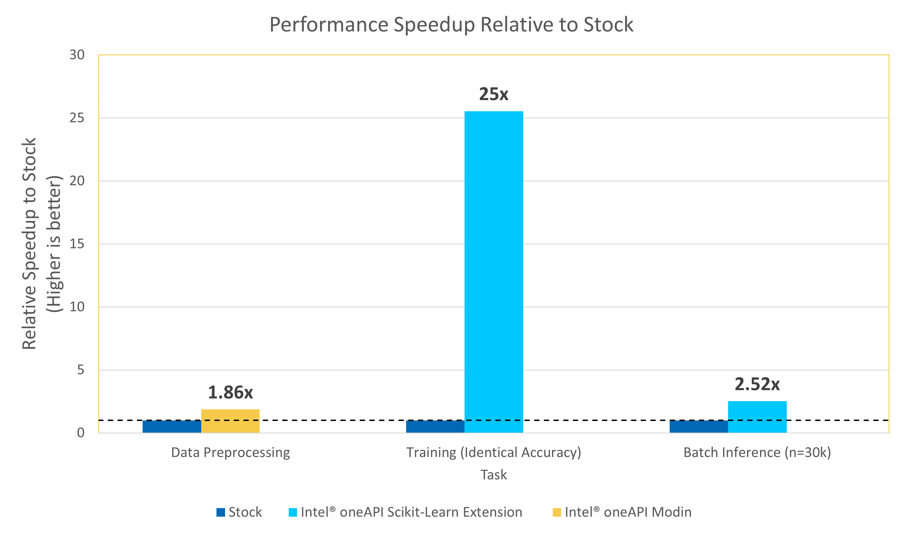

# **Scikit-Learn Intelligent Indexing for Incoming Correspondence**


Many industries ingest massive volumes of complex documents and must utilize manual processes to both understand the contents of and route them to the relevant parties.  AI-based Natural Language Processing (NLP) solutions for classifying documents can be one solution to automate this process, saving massive amounts of manpower, time, and cost while still maintaining human-level performance.  In this example, we demonstrate one way of building an NLP pipeline for classifying documents to their respective topics and describe how we can leverage the Intel® oneAPI AI Analytics Toolkit (oneAPI) to accelerate the pipeline.

Methodology wise, we will train a Support Vector Classifiers (SVC) for multiclass classification which ingests a body of text and outputs the predicted topic of the document.  At deploylment, natural text is first mapped into TFIDF vectors, which is then fed into our trained SVC to obtain predictions about the potential topic of the original text.  SVC is a commonly and historically used algorithm for building powerful NLP classifiers using ML due to its ability to tackle the highly non-linear and complex relationships often found in text documents [[1]](#joachims_1998)[[2]](#manning_2010).  With recent advancements in NLP based solutions, it can be seen as a starting point before considering more advanced DL based NLP algorithms.


The savings gained from using Intel® oneAPI can result in more efficient model training and inference, leading to more robust AI powered systems.


Intel® oneAPI is used to achieve quick results even when the data for a model are huge. It provides the capability to reuse the code present in different languages so that the hardware utilization is optimized to provide these results.

<a id="joachims_1998">[1]</a> Joachims, Thorsten. "Text categorization with support vector machines: Learning with many relevant features." European conference on machine learning. Springer, Berlin, Heidelberg, 1998.

<a id="manning_2010">[2]</a> Manning, Christopher, Prabhakar Raghavan, and Hinrich Schütze. "Introduction to information retrieval. Chapter 15." Natural Language Engineering 16.1 (2010): 100-103.


# Contents
 - [Key Implementation Details](#key-implementation-details)
 - [Usage/Instructions](#usageinstructions)
 - [Observations](#observations)


| **Optimized for**:                | **Description**
| :---                              | :---
| Platform                          | AWS EC2 Instances: m5n (Sky Lake) & m6i (Ice Lake)
| Hardware                          | CPU
| Software                          | Intel® oneAPI AI Analytics Toolkit v2021.4.1, Scikit-Learn, Pandas, NLTK
| What you will learn               | Intel oneAPI performance advantage over the vanilla versions
 

# Contents
 - [Key Implementation Details](#key-implementation-details)
 - [Usage/Instructions](#usageinstructions)
 - [Observations](#observations)

## Key Implementation Details 

In this section, we describe the data and how to replicate the results. The included code demonstrates a complete framework for:

  1. Setting up a virtual environment for stock/Intel®-accelerated ML
  2. Preprocessing data using Pandas/Intel® oneAPI Modin and NLTK
  3. Training an NLP model for text classification using scikit-learn/Intel® oneAPI scikit-learn extension
  4. Predicting from the trained model on new data using scikit-learn/Intel® oneAPI scikit-learn extension

### Dataset

The dataset used for this demo is a set of ~200k news article with their respective topics obtained by mining the Huffington Post website originally obtained from https://www.kaggle.com/datasets/rmisra/news-category-dataset.
> *Please see this data set's applicable license for terms and conditions. Intel does not own the rights to this data set and does not confer any rights to it.*

The included dataset is lightly preprocessed from above to split into train/test according to an 85:15 train test split. To download and setup this dataset for benchmarking, follow the instructions listed in the data directory [here](data/).

To demonstrate the application of multiclass document classification, using this dataset, we will build a model to predict the `category` of each news article based entirely on the `headline`, `short_description`, and `URL` of the given news article.  In total, there are 41 unique categories which are described in the link above.

### Intel® oneAPI optimizations enabled

#### *Intel® oneAPI Modin*

The Intel® Distribution of Modin* is a performant, parallel, and distributed dataframe system that is designed around enabling data scientists to be more productive with the tools that they love. This library is fully compatible with the pandas API. It is powered by OmniSci* in the back end and provides accelerated analytics on Intel® platforms.

Top Benefits:

1. Drop-in acceleration to your existing pandas workflows 
2. No upfront cost to learning a new API
3. Integrates with the Python* ecosystem
4. Seamlessly scales across multicores with Ray* and Dask* clusters (run on and with what you have)

#### *Intel® oneAPI Scikit-Learn-Extension*

Designed for data scientists, Intel® Extension for Scikit-Learn* is a seamless way to speed up your Scikit-learn applications for machine learning to solve real-world problems. This extension package dynamically patches scikit-learn estimators to use Intel® oneAPI Data Analytics Library (oneDAL) as the underlying solver, while achieving the speed up for your machine learning algorithms out-of-box.

## Prerequistes
[Anaconda installation](https://docs.anaconda.com/anaconda/install/linux/)

## Usage/Instructions

Benchmarking the given technologies on this ML pipeline can be broken down into 2 steps:

1. Creating an execution environment
2. Running the benchmarks using the selected execution environment

### 1. **Creating an execution environment**

The script `setupenv.sh` is provided to automate the setup of the conda environments necessary for running the benchmarks on different settings.

Conda environment setup
```shell
./setupenv.sh
```

The script provides the following options to create a conda execution environment:

|                                           | **Pandas** | **Modin** | **Scikit-Learn** | **Intel Scikit-Learn Extension** |
| :---                                      | :---:      | :---:     | :---:            |  :---:                           |
| **Stock**                                 | X          |           |  X               |                                  |
| **Intel® oneAPI AIKit**              | X          |  X        |  X               | X                                |

These scripts utilize the dependencies found in the `env/` directory to create each of the 2 execution environments.

| **YAML file**                                 | **Configuration**
| :---                                          | :--
| `env/intel.yml`                               | Intel® Python=3.7x with Intel® modin, Intel® scikit-learn extension
| `env/stock.yml`                               | Python=3.7.x  with pandas, scikit-learn


Example option selection for Intel® Python with stock libraries as given below
```shell
Select technology distribution:
    1. stock
    2. intel
#?: 1
```

Environment setup for each combination is required only once. This step does not cleanup the existing environment with the same name hence we need to make sure there is no conda environment exists with the same name. During this setup a new conda environment will be created with the dependencies listed in the YAML configuration. Below are the name of the environment names for each combinations given in the above table.

|                                           | **Name** 
| :---                                      | :---:                  
| **Stock**                          | `doc_class_stock`
| **Intel® oneAPI AIKit**       | `doc_class_intel`


### 2. **Running the Benchmarks**

To run the benchmarks on a selected configuration, the corresponding environment needs to be setup and activated.  For example, to benchmark the model training with ***Intel® oneAPI technologies***, the environment `doc_class_intel` should be configured using the `setupenv.sh` script and the environment should be activated using

```shell
conda activate doc_class_intel
```

#### Benchmark Scripts

All of the benchmarking can be run using the python script `src/run_benchmarks.py`.

The script **reads and preprocesses the data**, **trains an SVC model**, and **predicts on unseen test data** using the trained model, while also reporting on the execution time for these 3 steps.

> Before running the script, we need to ensure that the appropriate conda environment is activated.

The run benchmark script takes the following arguments:

```shell
usage: run_bechmarks.py [-h] [-l LOGFILE] [-i] [-p] [-s SAVE_MODEL_DIR]

optional arguments:
  -h, --help            show this help message and exit
  -l LOGFILE, --logfile LOGFILE
                        log file to output benchmarking results to
  -i, --intel           use intel accelerated technologies where available
  -p, --preprocessing_only
                        only perform preprocessing step
  -s SAVE_MODEL_DIR, --save_model_dir SAVE_MODEL_DIR
                        directory to save model to
```

To run with stock python and stock technologies, logging the performance to `logs/stock_stock.log`, we would run (after creating the appropriate environment as above) from `src` directory:
```shell
conda activate doc_class_stock
mkdir -p ../logs  # create `logs` dir in the parent dir if not present
python run_benchmarks.py -l ../logs/stock_stock.log
```

To run with Intel® technologies, logging the performance to `logs/intel_intel.log`, we woud run (after creating the appropriate environment as above):
```shell
conda activate doc_class_intel
mkdir -p ../logs  # create `logs` dir in the parent dir if not present
python run_benchmarks.py -i -l ../logs/intel_intel.log
```

## **Observations**

In this section, we demonstrate the benchmarking results comparing the Intel® technologies vs the stock alternative.  We break it down into the 3 primary tasks of this ML pipeline:

  1. Preprocessing data using Pandas/Intel® oneAPI Modin with the Ray Backend
  2. Training an NLP model for text classification using scikit-learn/Intel® oneAPI scikit-learn extension
  3. Predicting from the trained model on new data using scikit-learn/Intel® oneAPI scikit-learn extension

## Overall Performance speed-up in the E2E pipeline



## Key take aways and Conclusion

1. The Intel Distibution for Modin offers up to a 1.86x performance improvement on Data Preprocessing over Stock Pandas.
2. The Intel Scikit-Learn Extension offers up to a 25x performance improvement on SVC Model Training and up to a 2.5x performance improvement on Batch Inference (n=30k) over Stock Scikit-Learn.

Performance across the models trained using both scikit-learn and the Intel® oneAPI scikit-learn extension achieve the same level of accuracy (~0.64) on the test set with minimal hyper-parameter tuning.  However, the computational savings obtained by using SVM will allow us to perform expensive hyper parameter tuning in a MUCH shorter amount of time, optimizing the model in the future.

This exercise to categorize text data, can be used as a reference implementation across similar use cases with Intel AI optimizations enabled to accelerate the E2E process.

## Notes:
***Please see this data set's applicable license for terms and conditions. Intel® does not own the rights to this data set and does not confer any rights to it.***
